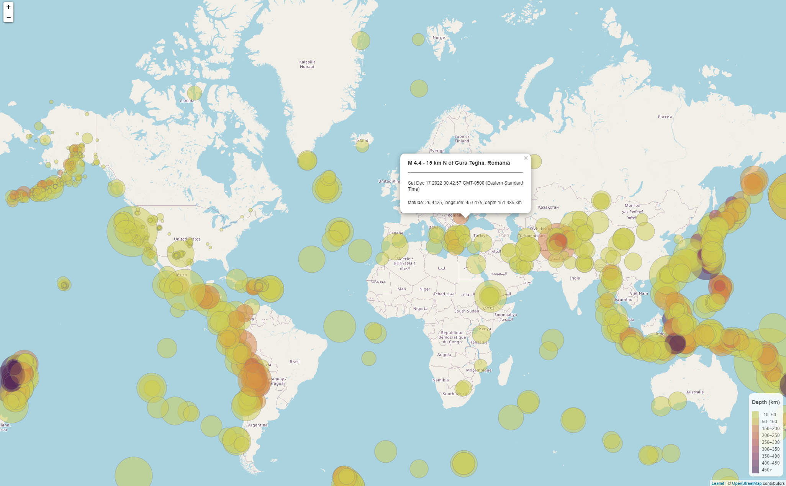
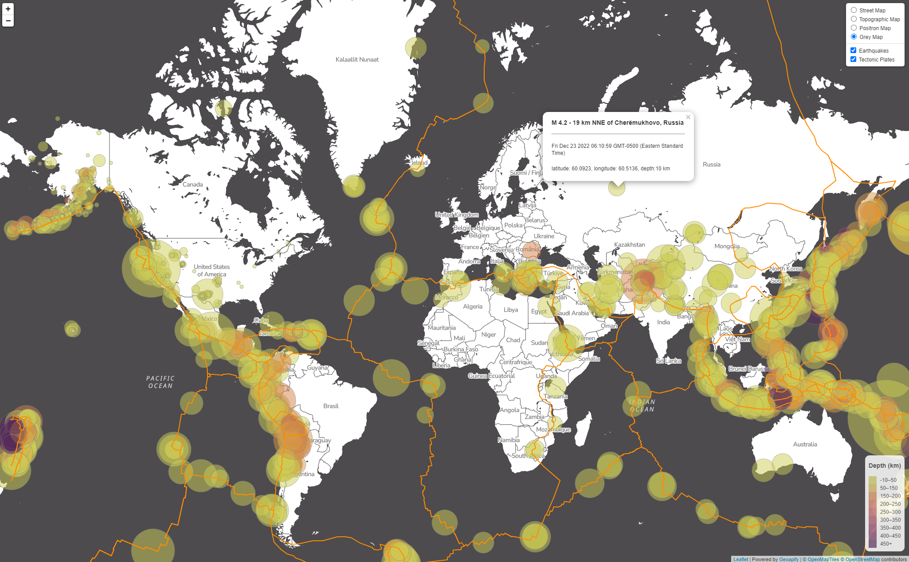

# Mapping US Geological Survey (USGS) data using Leaflet
The United States Geological Survey (USGS) is responsible for providing scientific data about natural hazards, the health of our ecosystems and environment, and the impacts of climate and land-use change. In this project, Leaflet is used to map USGS GeoJSON data of all earthquakes exceeding 2.5 magnitude within the past 30 days.

See maps:
* USGS Earthquakes
* USGS Earthquakes and Tectonic Plates

## Tools and Libraries
* Javascript
* Leaflet
* HTML
* D3
* CSS
* [USGS GeoJSON APIs](https://earthquake.usgs.gov/earthquakes/feed/v1.0/geojson.php)
* [OpenStreetMap](https://www.openstreetmap.org/about)
* [Geoapify](https://apidocs.geoapify.com/docs/maps/map-tiles/#about)

## Part 1: USGS Earthquake Map

This map plots all earthquakes above a 2.5 M within the past 30 days across the globe.

* Import USGS earthquake GeoJSON
* Plot earthquakes using Leaflet
* Data markers reflect the magnitude of the earthquake by their size and depth of earthquake by color
   * Higher magnitudes appear larger
   * Deeper earthquakes appear darker in color
* Include a pop-up with additional information about the earthquake
   * Magnitude
   * Location
   * Date and time
   * Lat/long
   * Depth
* Create a legend for the depth of the earthquakes

## Part 2: Gather and Plot More Data

This map includes an additional GeoJSON layer to visualize the relationship between tectonic plates and seismic activity. Data are available [here](https://github.com/fraxen/tectonicplates).

In addition to the map elements detailed in Part I:
* Plot the tectonic plates
* Add additional basemaps
* Add separate overlays for each dataset that can be toggled independently
* Add layer controls to the map

